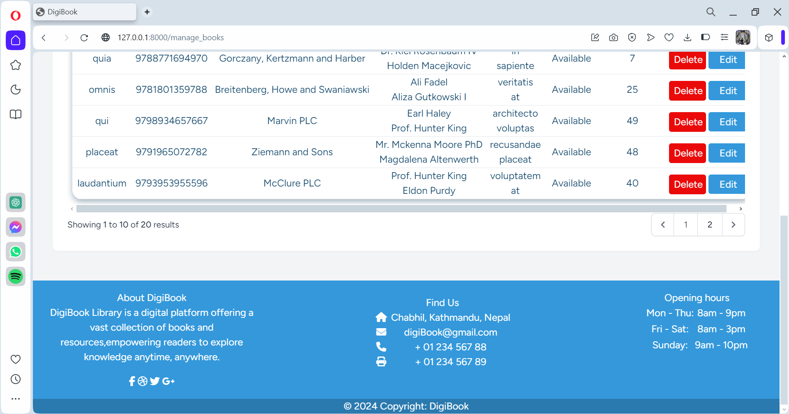
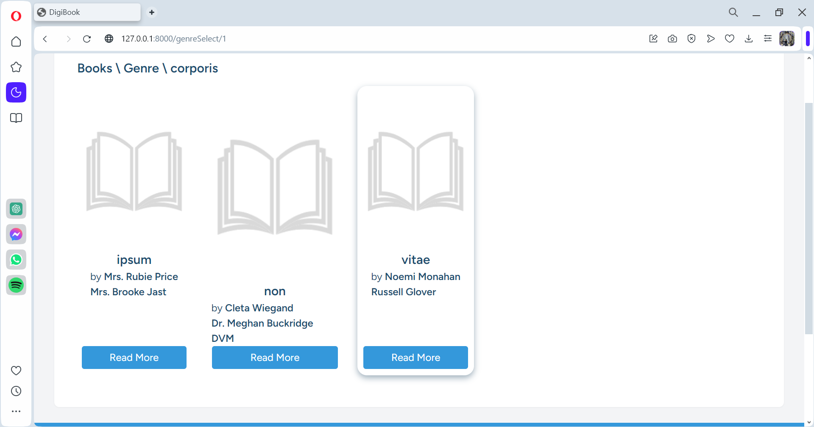
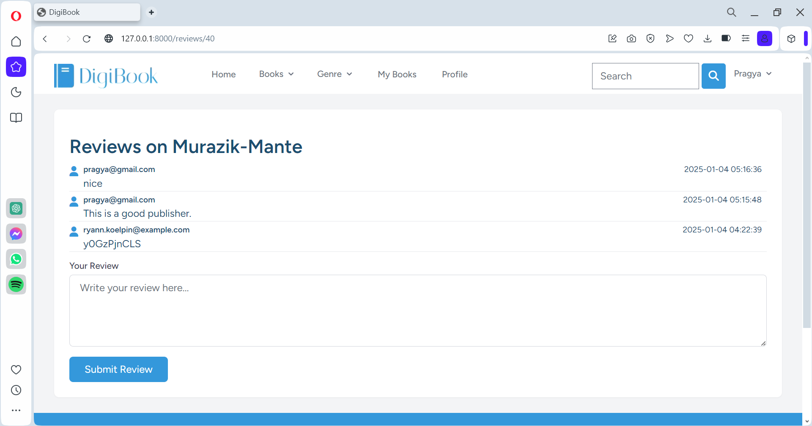
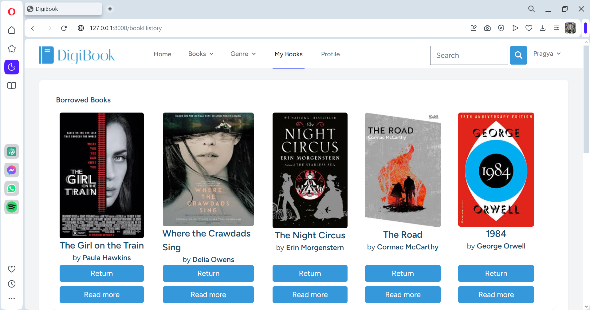
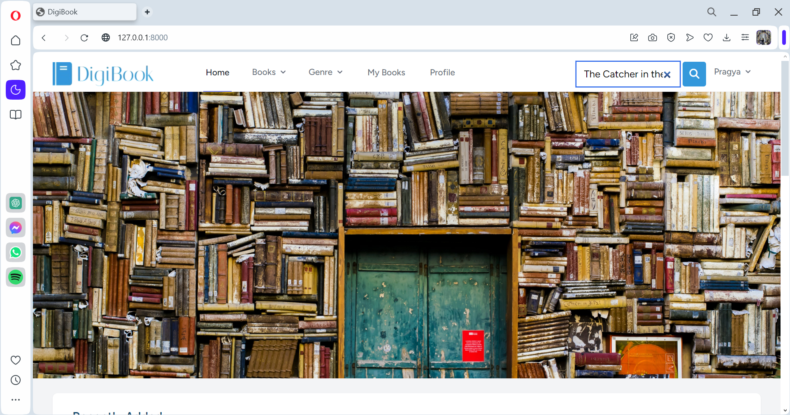
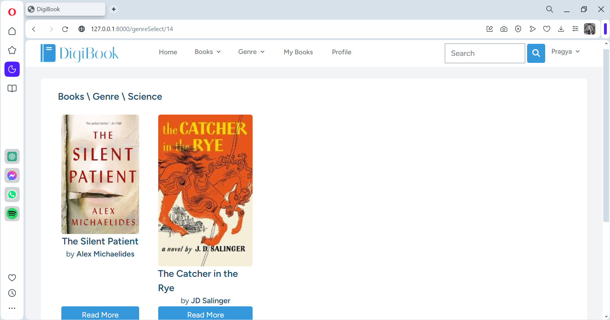

Library Management System (DigiBook) 

1.1	Introduction

DigiBook is a website which is designed to manage books, authors, publishers, borrowers and reviews for a library. There are features for three types of users: guest, user and admin user with access to different functionality. The website is developed using Laravel and bootstrap for front-end.

1.2	Installation Process:

Step 1: Install Laravel.

Step 2: Installing Laravel Breeze:

Step 3: Creating a laravel application called library-management-system.

Step 4: Install npm dependencies

Step 5: Finalise the database name and run the migration.

 
Step 6: Run the Laravel Server.

1.3	Features

1.3.1	Admin Features:

Author Management	

•	Admin can view exiting authors info.

•	Admin can add new author.

•	Admin can edit already existing author.

•	Admin can delete the existing author.

Publisher Management

•	Admin can view exiting publishers’ info.

•	Admin can add new publisher.

•	Admin can edit already existing publisher.

•	Admin can delete the existing publisher.

Genre Management	

•	Admin can view exiting genres info.

•	Admin can add new genre.

•	Admin can edit already existing genre.

•	Admin can delete the existing genre.

Book Management	

•	Admin can view exiting books info.

•	Admin can add new book.

•	Admin can edit already existing book.

•	Admin can delete the existing book.

Borrower info	

•	Admin can view borrowing history i.e. the borrowing info.

•	Admin can also view user info by clicking in the borrower name.

1.3.2	User Features:

Filter	

•	User can filter book through genre and availability.

Search	

•	User can search through publisher name, author name, ISBN number and book name.

Reviews	

•	User can review book.

•	User can review publisher.

•	User can review author.

Borrowing 	

•	User can borrow available books and return it (there is no need for admin approval).

1.3.3	Guest Features:

Filter	

•	User can filter book through genre and availability.

Search	

•	User can search through publisher name, author name, ISBN number and book name.

1.4 Seeder:

The seeder for user has 2 accounts 1 for admin and another for client so logging in is easier to login.

To run the seeder 'php artisan db:seed' is used: 

1.4.1 Project UI:

During the development and testing seeder is used so the photo is already existing in the storage folder that is the image in following images.

(1) Admin Books Pages:

Manage Books Page:

Add Book Page:

Edit Book Page:

Delete Book Page:

(2) Admin Authors Pages:

Manage Authors Page:

Add Author Page:

Edit Author Page:

Delete Author Page:

(3) Admin Publishers Pages:

Manage Publishers Page:

Add Publisher Page:

Edit Publisher Page:

Delete Publisher Page:

(4) Admin Genres Pages:

Manage Genres Page:

Add Genre Page:

Edit Genre Page:

Delete Genre Page:

(5) Admin Borrowers History Page:

(6) Profile Page:

(7) Home Page:(same for guest and logged user)

(8) Filter by Availability Page:

(9) Filter by Genre Page:

(10) Book History:

(11) Book Page:

(12)Reviews:

Publishers Review:

Author Review:

1.5 User Guide:

1.5.1 Admin: 

1.5.1.1 Genre:

(1) Add New Genre:

Click on the Add New Genre button in genre page:

Add the genre using the Add Button:

Incase there is no error genre is added.

(2) Edit Genre:

Click on the Edit button:

Edit any info if needed then, click on the Edit button to edit the genre:

(3) Delete genre:

Click on the delete button:

This alert will be shown, if the delete button is clicked then the 
genre is deleted and if cancel is clicked the genre isn't deleted.

1.5.1.2 Publishers:

(1) Add New Publisher:

Click on the Add New Publisher button in publisher page:

Add the pubisher using the Add Button:

If there is no error new publisher is added:

(2) Edit Publisher:

Click on the Edit button of publisher to edit:

Edit the pubisher info if needed then, click on edit button to edit the publisher:

(3) Delete Publisher:

Click on the delete button:

This alert will be shown, if the delete button is clicked then the 
publisher is deleted and if cancel is clicked the publisher isn't deleted.

1.5.1.3 Authors:

(1) Add New Author:

Click on the Add New Author button in author page:

Add the author using the Add Button:

If there is no error new author is added:

(2) Edit Author:

Click on the Edit button of author to edit:

Edit the author info if needed then, click on edit button to edit the author:

(3) Delete Author:

Click on the delete button:

This alert will be shown, if the delete button is clicked then the 
author is deleted and if cancel is clicked the author isn't deleted.

1.5.1.4 Books:

(1) Add New Book:

Click on the Add New Book button in book page:

Add the book using the Add Button:

If there is no error new book is added:

(2) Edit Book:

Click on the Edit button of book to edit:

Edit the book info if needed then, click on edit button to edit the book:

(3) Delete Book:

Click on the delete button:

This alert will be shown, if the delete button is clicked then the 
book is deleted and if cancel is clicked the author isn't deleted.

1.5.1 Normal User: 

1.5.1.1 Borrow:

Inorder to borrow the user must be logged in.

The user can easily borrow the available books using the borrow button.

The user can see all the borrow history from book history.

1.5.1.2 Publisher Review:

In the book page, there the publication that the book was released by. By clicking on the publication name
the reviews of the publication can be seen.

1.5.1.3 Author Review:

In the book page, there the authors that wrote the book. By clicking on the authors name
the reviews of the author can be seen.

1.5.1.4 Search Feature:

The books can be searched based on book name, isbn number, publisher name and author name.
If the search mataches it shows the list of book with the match.

1.5.1.4 Filter by Genre:

The books can be filtered by genre.

1.6 Version:

Php version -> 8.0.2

laravel version -> 9.19 
