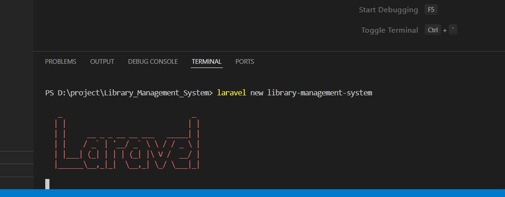

1	Library Management System (DigiBook) 

1.1	Introduction

DigiBook is a website which is designed to manage books, authors, publishers, borrowers and reviews for a library. There are features for three types of users: guest, user and admin user with access to different functionality. The website is developed using Laravel and bootstrap for front-end.

1.2	Installation Process:

Step 1: Install Laravel.

Step 2: Installing Laravel Breeze:

Step 3: Creating a laravel application called library-management-system.

Step 4: Install npm dependencies

Step 5: Finalise the database name and run the migration.

 
Step 6: Run the Laravel Server.

1.3	Features

1.3.1	Admin Features:

Author Management	

•	Admin can view exiting authors info.

•	Admin can add new author.

•	Admin can edit already existing author.

•	Admin can delete the existing author.

Publisher Management

•	Admin can view exiting publishers’ info.

•	Admin can add new publisher.

•	Admin can edit already existing publisher.

•	Admin can delete the existing publisher.

Genre Management	

•	Admin can view exiting genres info.

•	Admin can add new genre.

•	Admin can edit already existing genre.

•	Admin can delete the existing genre.

Book Management	

•	Admin can view exiting books info.

•	Admin can add new book.

•	Admin can edit already existing book.

•	Admin can delete the existing book.

Borrower info	

•	Admin can view borrowing history i.e. the borrowing info.

•	Admin can also view user info by clicking in the borrower name.

1.3.2	User Features:

Filter	

•	User can filter book through genre and availability.

Search	

•	User can search through publisher name, author name, ISBN number and book name.

Reviews	

•	User can review book.

•	User can review publisher.

•	User can review author.

Borrowing 	

•	User can borrow available books and return it (there is no need for admin approval).

1.3.3	Guest Features:

Filter	

•	User can filter book through genre and availability.

Search	

•	User can search through publisher name, author name, ISBN number and book name.

Seeder:

The seeder for user has 2 accounts 1 for admin and another for client so logging in is easier to login.

To run the seeder 'php artisan db:seed' is used: 

Project UI:

During the development and testing seeder is used so the photo is already existing in the storage folder that is the image in following images.

Manage Book Page:

Add Book Page:

Edit Book Page:

Delete Book Page:

